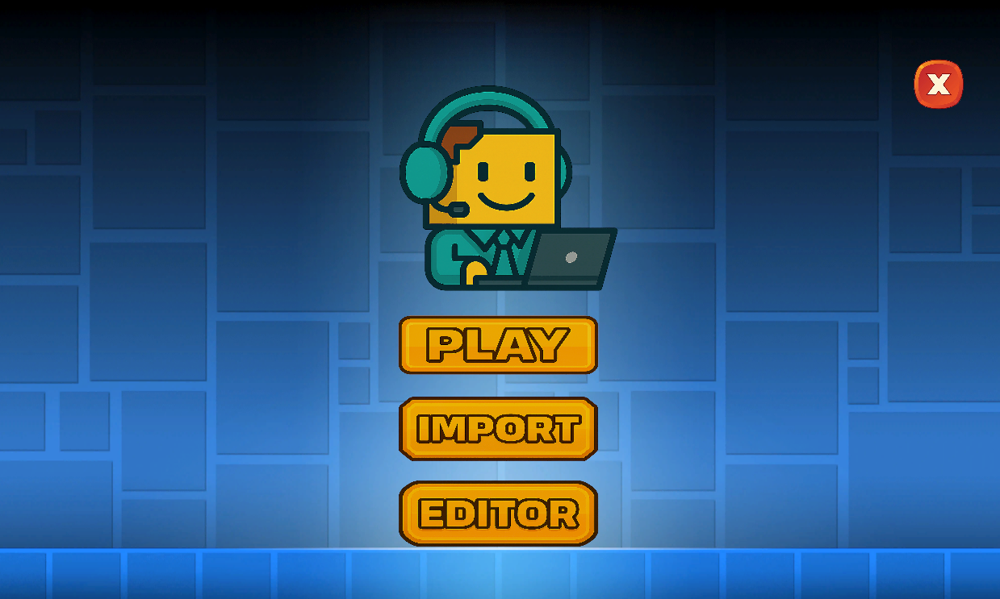
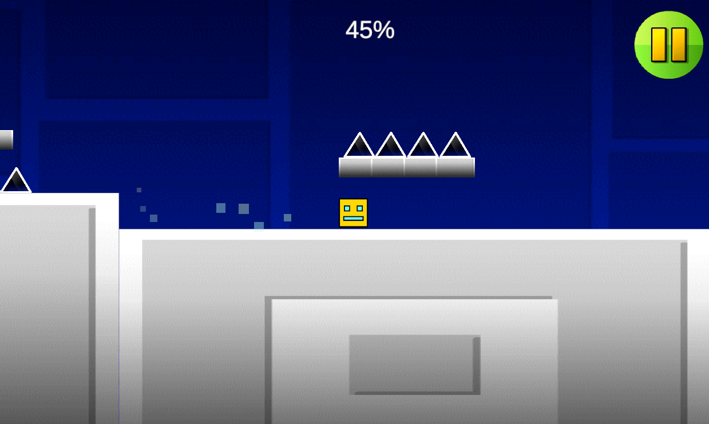

# CNAM Geometry Dash

## À propos

Développement d'une reproduction du jeu [Geometry Dash](https://fr.wikipedia.org/wiki/Geometry_Dash) réalisé dans le cadre de la formation [Ingénieur en Informatique et Systèmes d'Information (SI), CNAM](https://www.itii-alsace.fr/formations/informatique-et-systemes-dinformation-le-cnam/), pour les modules de Programmation Orientée Objet (POO) et de Méthodologie Systèmes d'Informations.

Afin de tester le jeu, plusieurs `.zip` avec l'exécutable sont disponibles, généré automatiquement grâce au déploiement continu de [GameCI](https://game.ci/), en fonction du système d'exploitation:

- [Windows (x64)](https://github.com/boudji-ludwig-pett/cnam-geometry-dash/releases/download/v1.0.1/windows.zip)
- [GNU/Linux (x64)](https://github.com/boudji-ludwig-pett/cnam-geometry-dash/releases/download/v1.0.1/linux.zip)
- [macOS (x64)](https://github.com/boudji-ludwig-pett/cnam-geometry-dash/releases/download/v1.0.1/macOS.zip)

### Membres du groupe

- [Djelal BOUDJI](https://github.com/djelalb)
- [Théo LUDWIG](https://github.com/theoludwig)
- [Vincent PETT](https://github.com/Vextriz)

### Documentation et Liens

- [Sujet](./Documentation/Sujet-Projet-Geometry-Dash.pdf)
- [Kanban Board (Trello)](https://trello.com/b/ugG5Siaw/cnam-geometry-dash)
- [Explication Diagrammes](./Documentation/diagrammes.md)
  - [Diagramme de GANTT](./Documentation/gantt-diagram.gantt)
  - [Diagrammes UML](./Documentation/UML)
- [Conventions développement informatique](./Documentation/conventions.md)
- [Unity - Prise de notes (Anglais)](./Documentation/unity.md)

## Prérequis

[Unity](https://unity.com/) v6000.0.49f1 (LTS)

## Installation

```sh
# Cloner le dépôt
git clone git@github.com:boudji-ludwig-pett/cnam-geometry-dash.git

# Se déplacer dans le dossier du projet
cd cnam-geometry-dash

# Ouvrir le projet avec Unity Hub
```

## Screenshots






